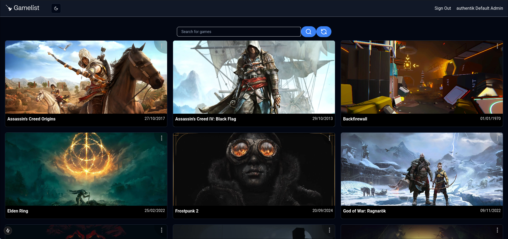

# Video Game Information App
[](https://www.codefactor.io/repository/github/strange500/gamelist)

## Overview

This project is a web application built with Next.js that provides an interactive interface for displaying information about video games using the RAWG API. Users can search for games, view detailed information, and download games directly from the server.

## Screenshots



## Features

- **Game Search**: Users can search for video games using various criteria.
- **Game Information**: Detailed information about each game, including title, genre, release date, and more.
- **Download Option**: Users can download games directly from the server.
- **Responsive Design**: The interface is designed to be responsive and user-friendly across devices.

## Technologies Used

- **Next.js**: A React framework for building server-side rendered applications.
- **RAWG API**: A rich API providing access to video game data.
- **React**: For building user interfaces.
- **CSS**: For styling the application.

## Installation

# Direct install

To set up and run this project locally, follow these steps:

1. **Clone the repository**:

    ```bash
    git clone https://github.com/Strange500/GameList
    ```

2. **Navigate to the project directory**:

    ```bash
    cd GameList
    ```

3. **Install the dependencies**:

    ```bash
    npm install
    ```

4. **Set up environment variables**:

    Create a `.env.local` file in the root of the project and add your RAWG API key:

    ```
    RAWG_API_KEY=your_api_key_here
    ```

5. **Run the development server**:

    ```bash
    npm run dev
    ```

6. **Open the application**:

    Open your browser and go to `http://localhost:3000`.

# Docker install

To set up and run this project using Docker, follow these steps:

1. **Build the Docker image**:

    ```bash
    docker build -t gamelist:latest .
    ```

2. **Run the Docker container**:
Pass the required environment variables as arguments: AUTH_AUTHENTIK_ID, AUTH_AUTHENTIK_SECRET, AUTH_AUTHENTIK_ISSUER, RAWG_API_KEY

```bash
docker run -p 3000:3000  -e AUTH_AUTHENTIK_ID=auth_id  -e AUTH_AUTHENTIK_SECRET=auth_secret -e AUTH_AUTHENTIK_ISSUER=auth_issuer -e RAWG_API_KEY=api_key_rawg -e GAME_FOLDER_PATH=/games -v path_to_games_folders:/games gamelist
```

3. **Open the application**:

    Open your browser and go to `http://localhost:3000`.


## Usage

Once the application is running:

1. Use the search bar to find video games by title, genre, or other criteria.
2. Click on a game to view detailed information, including images, descriptions, and release dates.
3. If the game is available for download, click the download button to save it to your device.

## Acknowledgments

- Thanks to the RAWG API for providing a rich source of video game data.
